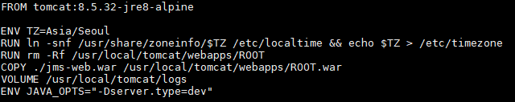
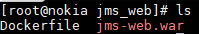
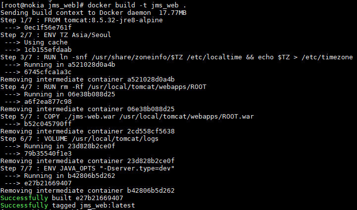
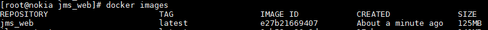
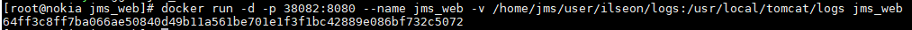
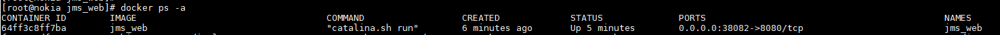
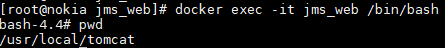

## Dockerfile 생성
* Dockerfuile에 설정된 내용대로 이미지가 생성됨
  
  * FROM : 어떤 이미지를 기반으로 생성할 지 설정
  * ENV : 환경 변수 설정. 설정한 환경 변수는 RUN, CMD, ENTRYPOINT에 적용됨
  * RUN : FROM에서 설정한 이미지 위에서 스크립트 혹은 명령을 실행
  * COPY : 파일을 이미지에 추가
  * VOLUME : 디렉터리 내용을 컨테이너에 저장하지 않고 호스트에 저장하도록 설정
  단, 호스트의 특정 디렉터리와 연결하고자 할 시 docker run 명령에서 -v 옵션 필요함

## Docker 빌드
* Docker 이미지를 만들 war 파일과 Dockerfile 파일을 같은 경로에 둠
  
* docker build <옵션> <Dockerfile 경로>
  * 옵션
    * -t : 생성할 이미지 이름 지정
<pre><code>docker build -t jms_web .</code></pre>

## Docker 이미지 확인
* docker images

## Docker 컨테이너 실행
* docker run <옵션> <이미지 이름, ID> <명령> <매개변수>
  * 옵션
    * -d : Detached 모드, 데몬 모드, 컨테이너 백그라운드로 시랳ㅇ
    * -p : 호스트에 연결된 컨테이너의 특정 포트를 외부로 노출
    * --name : 컨테이너 이름 설정
    * -v : 데이터 볼륨 설정, 호스트와 공유할 디렉터리 설정, 파일을 컨테이너에 저장하지 않고 호스트에 바로 저장
<pre><code>docker run -d -p 38082:8080 --name jms_web -v /home/jms/user/ilseon/logs:/usr/local/tomcat/logs jms_web</code></pre>

## 실행 컨테이너 확인
* docker ps -a

## 컨테이너 접속
* docker exec -it <이미지 이름, ID> /bin/bash
  
